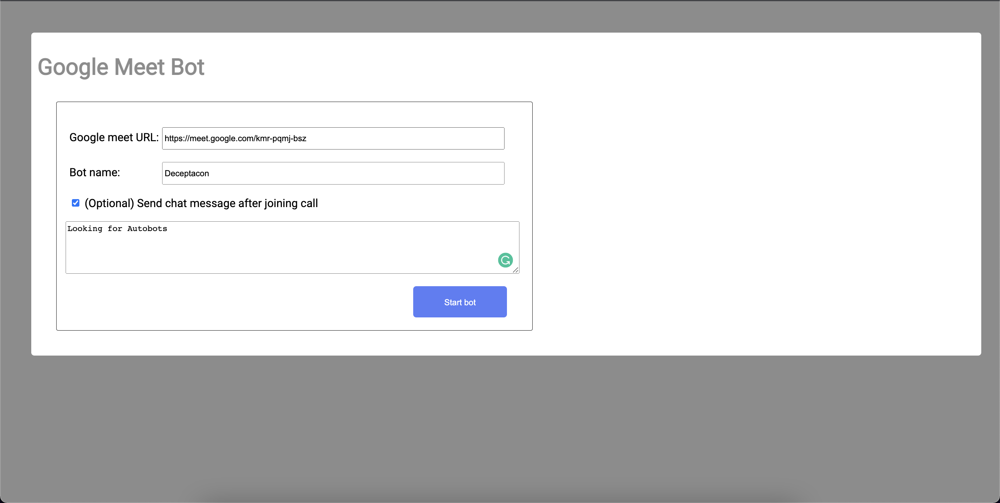
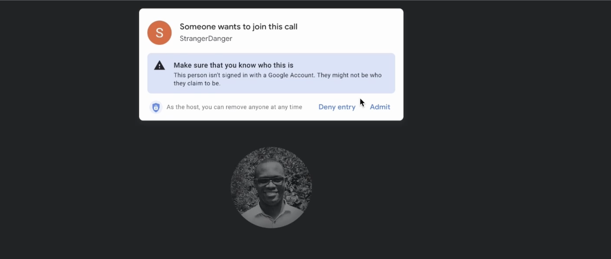

# googleMeetBot

### Description
This is a bot that joins a google meeting as an anonymous user and leaves a chat message.

### Running the project.
To run this project, the following need to be available.
1. Docker
2. Docker compose

#### Steps
1. Clone the project from Github.

2. To run the service, in the root folder, run;
(Note: This has been tested on the apple M1 architecure only).
```
docker compose up --build
```
This is only required the first time. For the subsequent runs;
```
docker compose up
```
3. Start the google meeting.
4. On your browser, (preferably Chrome), visit [http://localhost:8000](http://localhost:8000).

5. Enter the google meet URL, the bot name and optionally, a message that the bolt will post to the chat after joining the call. Click the "Create bot" button.
6. While in the meeting, wait for the bot to request access to the meeting. On the dialog, click Admit.

7. Once the bot has joined the call, wait for it to chat message to come in.

### ToDo;
1. Allow more interactions with the bot from the UI. These interactions could include:
- post a message directly from the UI
- leave the call from the UI.
- have the bot send progress updates to the UI.

2. Add unit and API tests
3. The service still runs on the development server. For production purposes, add an Nginx and gunicorn to serve the django service
4. Add Authentication to allow only authorized access of the UI.
5. Have the project host more sessions, to have multiple bot work at the same time.
6. Persist session data for analysis or future reference.

### Concerns;
1. Google meet continuously flags bots, making it harder to join calls consistently. Find out a way to consistenly join without detection.
